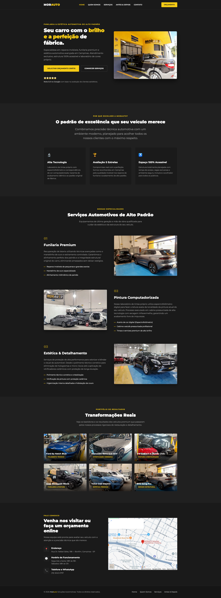

# 🚗 MORAUTO - Soluções Automotivas Premium

> Landing page institucional de alto padrão desenvolvida com foco em conversão, arquitetura CSS modular e total responsividade para a oficina mecânica Morauto (Campinas - SP).

Este projeto consiste em uma interface digital comercial de página única (_One-Page Layout_) em modo escuro (_Dark Mode_). O sistema foi projetado sob medida para o público de veículos premium e importados, aplicando conceitos avançados de estruturação semântica, controle geométrico dimensional e otimização de performance para conversão direta de leads via WhatsApp.

---

## 🚀 Demonstração

🔗 [Clique aqui para visitar o projeto rodando ao vivo](https://lincolnberto.com/meus-projetos/morauto/)

---

## 📸 Preview Visual



---

## 🛠️ Stack Tecnológica

- **Estrutura:** HTML5 Semântico (Foco em Acessibilidade e SEO)
- **Estilização:** CSS3 Puro (Arquitetura Modular Nativa)
- **Integrações:** Google Maps Embed API
- **Tipografia:** Google Fonts (Montserrat Family)
- **Versionamento:** Git & GitHub (Fluxo de Conventional Commits)

---

## 📐 Decisões de Arquitetura e Engenharia de Estilos

Durante o desenvolvimento do projeto, priorizei a escalabilidade do código e a experiência do usuário (UX), aplicando técnicas de mercado como:

- **CSS Modular (7-1 Simplificado):** Divisão estrita de responsabilidades em arquivos isolados de escopo (`global.css`, `home.css`, `home-responsive.css`) unificados através de um arquivo mestre (`main.css`) usando a regra `@import`.
- **Variáveis Globais (`:root`):** Centralização de tokens de design (paleta de cores oficial baseada no logotipo real da oficina e tipografia) para fácil manutenção.
- **Layout Híbrido:** Uso estratégico de **Flexbox** para componentes unidimensionais (Header com efeito de vidro fosco `backdrop-filter: blur`, Seção Hero e Seção Serviços em zigue-zague) combinado com **CSS Grid Layout** bidimensional simétrico para a grade de fotos do portfólio.
- **Pixel-Perfection e Controle de Fluxo:** Utilização de `object-fit: cover` nas mídias e propriedades como `position: static` nos pseudo-elementos (`::before` e `::after`), travando as dimensões dos cards de galeria em `280px` para evitar quebras visuais e distorções causadas por fotos nativas de smartphones.

---

## 📁 Estrutura de Diretórios

```text
morauto-solucoes-automotivas/
├── assets/
│   ├── fachada-morauto.png
│   ├── oficina-interna-byd.png
│   ├── oficina-interna-pintura.png
│   ├── oficina-mercedes-estetica.png
│   ├── (demais imagens do portfólio real)
├── css/
│   ├── main.css
│   ├── global.css
│   ├── home.css
│   └── home-responsive.css
├── index.html
├── .gitignore
└── README.md
```

---

## 📌 Principais Aprendizados e Resolução de Desafios

O desenvolvimento deste projeto consolidou habilidades práticas fundamentais para o dia a dia de um Desenvolvedor Front-end profissional:

- **Micro-interações elegantes:** Implementação de animações nativas com `@keyframes` e transições de `transform: translateY` para fornecer feedbacks visuais de interatividade ao usuário.
- **Web Performance & UX:** Utilização de `scroll-behavior: smooth` para rolagens internas suaves e o uso do atributo `loading="lazy"` nativo no `<iframe>` do mapa interativo, impedindo que o carregamento de scripts externos bloqueie a renderização inicial da página.
- **Cálculo de Viewport e Fixação:** Uso de `scroll-padding-top` para mitigar o problema clássico de cabeçalhos fixos (`position: fixed`), impedindo que o menu cubra as tags de título durante o clique nas âncoras.
- **Gestão Avançada de Versionamento:** Aplicação da convenção internacional de commits organizados por contexto (`feat:`, `fix:`, `style:`, `refactor:`, `chore:`) e resolução cirúrgica de conflitos de sincronização local-remoto utilizando o comando `git pull origin main --rebase`.

---

## 👨‍💻 Autor

Desenvolvido com dedicação por **Lincoln Berto**.

- **Portfólio:** [https://lincolnberto.com](https://lincolnberto.com)
- **LinkedIn:** [https://www.linkedin.com/in/lincoln-berto/](https://www.linkedin.com/in/lincoln-berto/)
- **GitHub:** [https://github.com/eilincoln](https://github.com/eilincoln)
